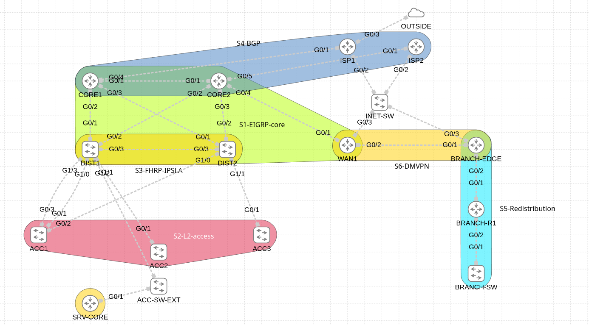

# CCNP Enterprise — EIGRP Core Lab

A CML lab built around an EIGRP named-mode core, layered with campus, WAN and internet-edge features. Full walkthrough in [ccnp-eigrp-lab-config-guide.md](ccnp-eigrp-lab-config-guide.md).

## Lab at a glance

- **EIGRP core:** AS 100 named mode on CORE1/CORE2/DIST1/DIST2 with SHA-256 auth, summarization, a stub and variance
- **Layer 2 access:** VLANs 10/20/99, LACP EtherChannel, RSTP root split, port hardening
- **FHRP:** HSRPv2 with IP SLA tracking for upstream failover
- **BGP edge:** eBGP to two ISPs (AS 65001/65002), iBGP across the core (AS 65000)
- **Redistribution:** tagged mutual EIGRP ↔ OSPF on BRANCH-EDGE
- **DMVPN:** Phase 1 hub-and-spoke (WAN1 → BRANCH-EDGE) with EIGRP over the tunnel
- **Addressing:** /32 loopbacks as router-IDs, /31 point-to-point transit links
- **Challenge:** a 23-step unguided rebuild from a blank topology

## Topology

