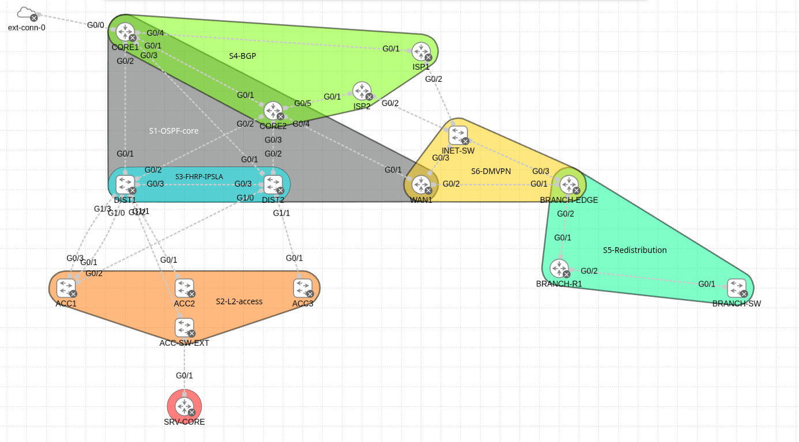

# CCNP Enterprise — OSPF Core Lab

A CML lab built around a per-interface OSPF core, layered with campus, WAN and internet-edge features. Full walkthrough in [ccnp-lab-config-guide-enterprise.md](ccnp-lab-config-guide-enterprise.md).

## Lab Details

- **OSPF core:** Area 0 on CORE1/CORE2/DIST1/DIST2, enabled per interface, with point-to-point /31s and SHA-256 auth
- **Area types:** NSSA Area 20 toward the branch (WAN1 as ABR), stub Area 10 toward services
- **Layer 2 access:** VLANs 10/20/99, LACP EtherChannel, RSTP root split, port hardening
- **FHRP:** HSRPv2 with IP SLA tracking for upstream failover
- **BGP edge:** eBGP to two ISPs (AS 65001/65002), iBGP across the core (AS 65000), local-pref and AS-path prepend
- **Redistribution:** tagged mutual OSPF ↔ EIGRP on BRANCH-EDGE
- **DMVPN:** Phase 1 hub-and-spoke (WAN1 → BRANCH-EDGE) with EIGRP over the tunnel
- **Challenge:** an unguided rebuild from a blank topology

## Topology

