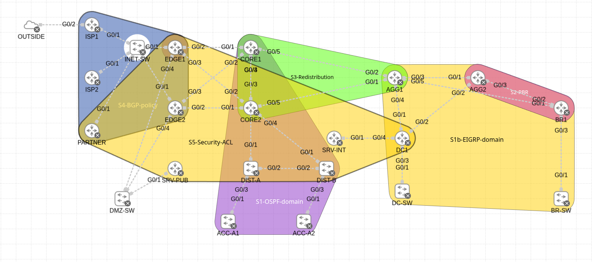

# CCNP Enterprise — Policy Lab (ACLs & Route-Maps)

A ~22-node CML lab built to exercise ACLs and route-maps end to end across two IGPs, a BGP edge and a PBR path. Full walkthrough in [ccnp-policy-acl-routemap-guide.md](ccnp-policy-acl-routemap-guide.md).

## Lab at a glance

- **Routing substrate:** OSPF Area 0 on the campus side, EIGRP AS 100 named mode on the DC/branch side
- **PBR:** branch traffic steered to a second upstream on BR1, with IP SLA and verify-availability for fail-back
- **Redistribution route-maps:** tagged OSPF ↔ EIGRP at AGG1 with prefix-list filtering, OSPF → BGP with community 65000:100
- **BGP path control:** two ISPs and a partner, local-pref and AS-path prepend to prefer ISP1, community and AS-path policy for the partner
- **Security ACLs:** extended named, time-based and reflexive ACLs on user, DMZ and DC segments
- **Edge protection:** infrastructure ACL, VTY access-class and CoPP on EDGE1
- **Challenge:** an unguided rebuild from a blank topology

## Topology

